# Multi-Modal Predictors for Cardiovascular Disease Risk and Outcomes

**Author:** Angel Morenu  
**Affiliation:** University of Florida, M.S. in Applied Data Science  
**Course:** EEE 6778 – Applied Machine Learning II (Fall 2025)
**Instructor:** Dr. Ramirez-Salgado


---

## Project Overview

Cardiovascular disease (CVD) remains the leading global cause of death. Existing predictive models often rely on a single data modality, limiting their accuracy and applicability in real-world settings.

This project develops a multi-modal machine learning system that combines:
- Tabular demographic data
- Hospital admission records
- Physiological ECG signals

to improve CVD risk prediction and make model outputs explainable, accessible, and deployable on edge devices.

---
## GitHub Repository

Repository: https://github.com/angelmorenu/multi-modal-cvd-predictor

Clone:
```bash
git clone https://github.com/angelmorenu/multi-modal-cvd-predictor.git
cd multi-modal-cvd-predictor
```
---

## Datasets Used

| Dataset | Description | Link |
|--------|-------------|------|
| Cardiovascular Diseases | Demographics and lifestyle features | [View on Kaggle](https://www.kaggle.com/datasets/mexwell/cardiovascular-diseases) |
| Hospital Admissions | Clinical visit and diagnostic records | [View on Kaggle](https://www.kaggle.com/datasets/ashishsahani/hospital-admissions-data) |
| PTB-XL ECG | 12-lead ECG signals and annotations | [View on Kaggle](https://www.kaggle.com/datasets/khyeh0719/ptb-xl-dataset-reformatted) |

---

## Project Architecture

This hybrid workflow uses:
- scikit-learn for preprocessing and tabular baselines
- PyTorch for ECG deep learning and feature fusion
- Streamlit for the user interface
- Conceptual edge deployment (e.g., smartwatch scenario)



---

## Environment Setup

Install with conda (choose your platform file):
```bash
# macOS (Intel or Apple Silicon M1/M2/M3; uses CPU/MPS)
conda env create -f environment.macos.yml
conda activate cvd_predictor

# Linux/Windows with NVIDIA GPU (CUDA 11.8)
conda env create -f environment.cuda.yml
conda activate cvd_predictor
```

Notes:
- On Apple Silicon, PyTorch uses the MPS backend automatically when available; the notebook prints the selected device.
- If you prefer a single cross-platform file, `environment.yml` is CPU/MPS-friendly (no CUDA packages) and should work on macOS/Intel/Linux.
- If you run into slow dependency solving, consider using mamba.

---

## Run the Project

Run setup and EDA:
```bash
jupyter notebook setup.ipynb
```

Launch the Streamlit UI:
```bash
streamlit run ui/app.py
```

---

## Deliverables

- data/ – Local/raw datasets (not versioned)
- notebooks/ – EDA and setup
    - setup.ipynb
- src/ – Core code
    - preprocess.py – Data preprocessing (tabular/ECG)
    - model.py – Modeling, training, fusion
- ui/ – Streamlit interface
    - app.py – Main app
    - MultiModalCVD_app.py – Alternate prototype
- docs/ – Diagrams and documentation
    - multimodal_cvd_architecture.png
- results/ – Optional visualizations and metrics
- environment.yml – CPU/MPS environment
- environment.cuda.yml – CUDA environment
- environment.macos.yml – macOS environment
- README.md – Project overview and instructions
- Morenu_Project Deliverable 1.docx – Written deliverable
- Morenu_Angel_Deliverable1_TechnicalBlueprint.pdf – Exported PDF
---

## Responsible AI Goals

- Fairness: Evaluate across age/gender/race subgroups
- Transparency: Use SHAP + attention maps
- Efficiency: Support lightweight edge deployment

---

## Contact

For questions, reach out via GitHub or university email.
